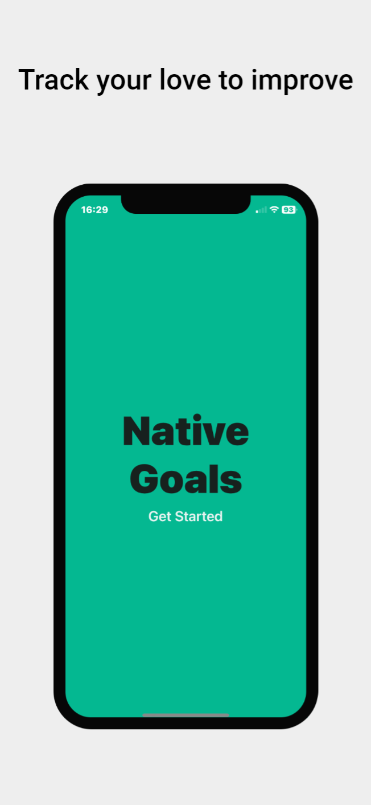
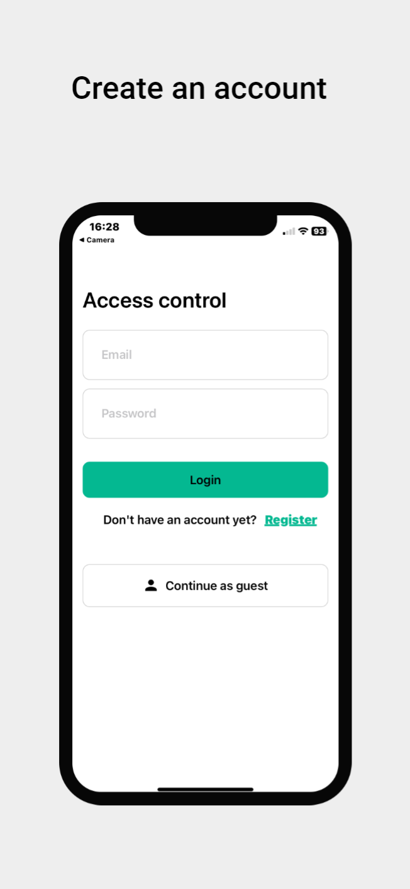
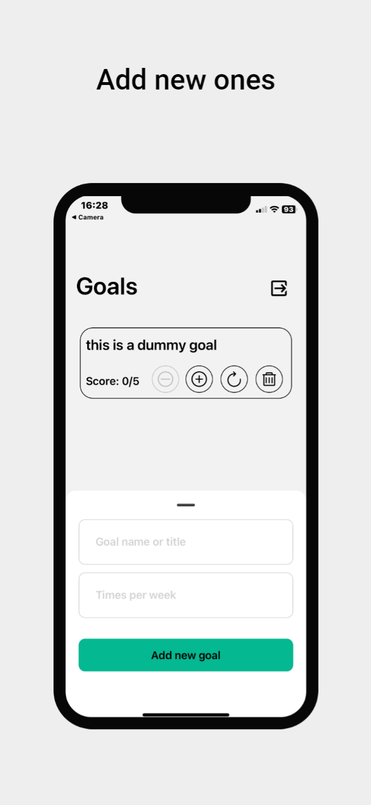

# React Native Goals

<table width="100%">
  <tr>
  <td width="33%">
    
  </td>
  <td width="33%">
    
  </td>
  <td width="33%">
    
  </td>
  </tr>
</table>

Mobile app of [React Daily Goal Tracker](https://github.com/davide2894/react-daily-goal-tracker), a web app I build previously to track weekly goals on a daily basis.

## User journey

This is a weekly goal tracking app, which means its purpose is to set weekly goals to meet each day.

When the app is opened, the user can access the Goals screen by either using a guest account, registering a new account or loggin in his/her own account.

If a page is refreshed or reloaded, the account and the goal are persisted, which means that the user session is kept, hence the account keeps being logged in.

### Refresh token

This app uses the [Refresh token with rotation](https://auth0.com/docs/secure/tokens/refresh-tokens/refresh-token-rotation#:~:text=Refresh%20token%20rotation%20is%20a,shorter%2Dlived%20access%20tokens%20expire.) security strategy

## Note

This app uses [Expo](https://docs.expo.dev/) - a framework to develop React Native apps easily withouth worrying about all the setup needed to start working on a native mobile app - and [Expo Go](https://docs.expo.dev/get-started/expo-go/), a sandbox that let you run and test your locally developed app on a physical device (IOS or Android) without needing to publish your app on the respective app store

## Technologies being used

- [React Native](https://reactnative.dev/)
- [Apollo Client](https://www.apollographql.com/docs/react/)
- [GraphQL](https://graphql.org/)
- [Apollo Server](https://www.apollographql.com/docs/apollo-server/)
- [Nest.js](https://docs.nestjs.com/)
- [Prisma.io](https://www.prisma.io/)
- [Sqlite](https://www.sqlite.org/index.html)
- [Typescript](https://www.typescriptlang.org/)
- [Turborepo](https://turbo.build/repo)
- [Expo](https://docs.expo.dev/)
- [Expo Go](https://docs.expo.dev/get-started/expo-go/)

## Installing

Run the command `npm i` at the root folder level

## Executing program

To run locally this app you need to follow these steps

### Download the Expo Go app

Download Expo Go from the app store of your mobile device (App Store for IOS and Play Store for Android)

### Expose the local server with Ngrok

- Download and intstall [Ngrok](https://ngrok.com/download), a software needed to expose the local backend server to the internet, so that it is accessible from the Expo Go app
- Open a terminal
- Run the command `ngrok http 3000`
- Once Ngrok generates the public url, open the `Router.tsx` and replace the url inside the httpLink variable, as shown below

`const httpLink = new HttpLink({
uri: <replace link here>,
});`

### Run the backend locally

- Open a terminal in the project root folder
- Run `cd apps/react-native-goals-backend`
- Run `npm run prisma:generateClient`
- Run `npm run start:watch`

### Run the frontend locally

- Open a terminal in the project root folder
- Run `cd apps/react-native-goals-frontend`
- Run `npm run start` (you may need to run expo in tunnel mode in some cases, with the `npm run start --tunnel` command)
